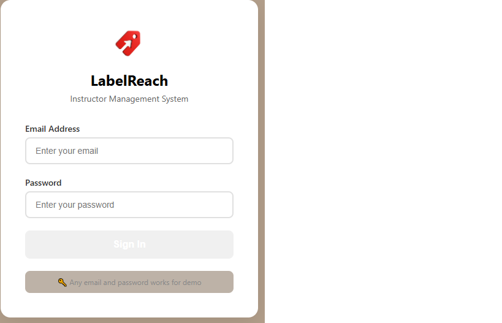
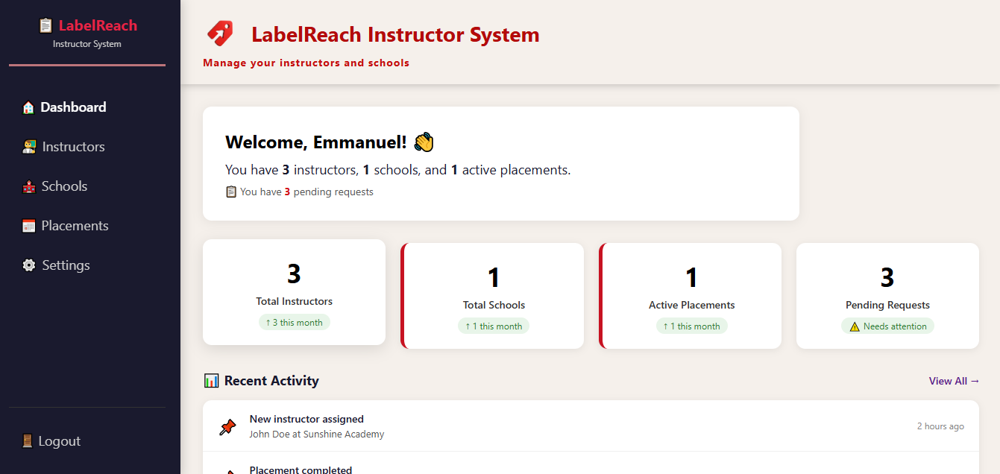
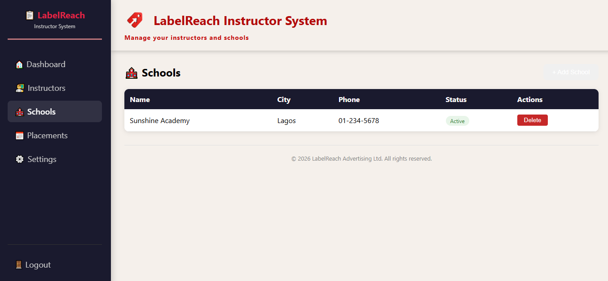

# 📋 LabelReach Instructor Management System

A professional instructor management system built for **LabelReach Advertising Ltd** to manage instructors, schools, and placements.

---

## 🎯 The Problem

As the founder of **LabelReach Advertising Ltd** and **Edumate Coding Academy**, I needed a way to manage the growing number of instructors deployed to schools. Without a centralized system, it was difficult to:
- Track which instructors are available
- Know which schools they're assigned to
- Monitor active placements
- See pending requests at a glance

---

## 💡 The Solution

I built the **LabelReach Instructor Management System** – a professional dashboard that provides a bird's-eye view of all operations.

---

## ✨ Key Features

| Feature | Description |
|---------|-------------|
| **Dashboard** | View total instructors, schools, and active placements instantly |
| **Instructors** | Add, view, and delete instructors |
| **Schools** | Add, view, and delete schools |
| **Placements** | Assign instructors to schools and track status |
| **Settings** | View system information |
| **Login/Logout** | Secure access with demo login |

---

## 🛠️ Technologies Used

| Technology | Purpose |
|------------|---------|
| **React** | Frontend framework |
| **CSS** | Custom styling with brand colors |
| **Node.js + Express** | Backend API server |
| **PostgreSQL** | Database for storing data |
| **Sequelize** | ORM for database operations |
| **Git & GitHub** | Version control |
| **Vercel** | Deployment |

---

## 📊 Brand Colors

- **Primary Red:** `#70000`
- **Gold Accent:** `#F5A623`
- **Dark Sidebar:** `#1A1A2E`

---

## 📸 Screenshots

## 📸 Screenshots
## 📸 Screenshots

### Login Page

https://labelreach.com/wp-content/uploads/2026/06/login.png

### Dashboard

https://labelreach.com/wp-content/uploads/2026/06/dashboard.png

### Instructors Page

https://labelreach.com/wp-content/uploads/2026/06/Instructors.png

### Schools Page

https://labelreach.com/wp-content/uploads/2026/06/schools.png

### Placements Page

https://labelreach.com/wp-content/uploads/2026/06/Placements.png

---

## 🚀 Live Demo

🔗 [LabelReach Instructor System](https://labelreach-instructor-system.vercel.app)


## 📂 Project Structure

LabelReach-Instructor-System/
├── backend/
│ ├── config/
│ │ └── database.js
│ ├── models/
│ │ ├── index.js
│ │ ├── Instructor.js
│ │ ├── School.js
│ │ └── Placement.js
│ ├── routes/
│ │ ├── authRoutes.js
│ │ ├── instructorRoutes.js
│ │ ├── schoolRoutes.js
│ │ ├── placementRoutes.js
│ │ └── statsRoutes.js
│ ├── .env
│ ├── package.json
│ └── server.js
├── frontend/
│ └── src/
│ ├── App.js
│ ├── App.css
│ ├── Sidebar.js
│ ├── Sidebar.css
│ ├── Login.js
│ ├── Login.css
│ ├── Instructors.js
│ ├── Schools.js
│ ├── Placements.js
│ └── Settings.js
└── README.md


---

## 🏃 How to Run Locally

### 1. Clone the Repository
```bash
git clone https://github.com/emmanueladekunlep/LabelReach-Instructor-System.git
cd LabelReach-Instructor-System


Set Up the Backend
cd backend
npm install
npm run dev

Set Up the Frontend
cd frontend
npm install
npm start

4. Access the App
Frontend: http://localhost:3000

Backend: http://localhost:5001

5. Login Credentials
Email: Any email works

Password: Any password works

👨‍💻 Author
Emmanuel Adekunle Peace

Founder, LabelReach Advertising Ltd

Founder, Edumate Coding Academy

Portfolio

📝 License
This project is for portfolio demonstration purposes.

🙏 Acknowledgments
Built as part of my full-stack development portfolio

Inspired by real business needs at LabelReach and Edumate
